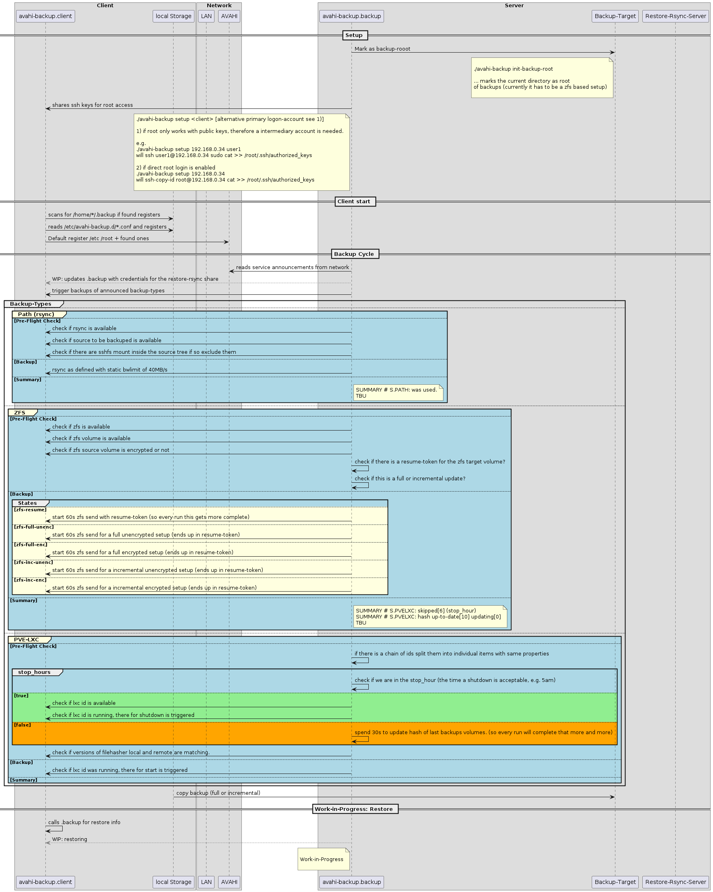

 

# avahi-backup
avahi based Backup as a Service (BaaS) ;)

Clients tell what they would like to have backup-ed and the server takes care about it, generally no central configuration for clients needed.
(besides onetime authorization)

# Roadmap

* [X] Show up at github
  * [X] document global concept
* [ ] PoC
  * [X] support of rsync backup method
  * [X] support of zfs send backup method
      * [X] Full/Incremental
      * [X] plain/encrypted
      * [X] Support for resume-token (resume transfer)
  * [X] support for proxmox targets
      * [ ] Targets
        * [ ] lxc containers
        * [ ] vms
      * [ ] Storage types
        * [ ] dir
  * [ ] Restore concept
* [ ] First full release
  * [ ] deb installation procedure
  * [ ] code cleanup
  * [ ] full client and server workflow implemented (backup)
* [ ] Beyond
  * [ ] Implement restore concept (if there is interest)
  * [ ] Support of for methods
  * [ ] More options to configure static assumptions

# what is this?

Avahi backup is a backup concept i developed after my last maturing step of my backup concept for my home setup.

How does my home setup look like:
- Proxmox server
- Debian Notebooks
- Family deb packages to configure everything, like family-notebook.deb for what a notebook should have etc...

Before "avahi-backup" i had a bash script for my backup with something like:
```bash
declare -A backup
backup[root@192.168.0.4]="/opt:/export/disk1/backup/192.168.0.4/opt"
backup[root@192.168.0.4]="/home:/export/disk1/backup/192.168.0.4/home"
...
```

so all handcrafted entries.

Now it looks like:
- backup clients define a avahi-publish for "_backup._tcp" with TXT like - "path=/home/user1" "path=/etc" "path=/root" "path=/export/disk4-ssd/data"
- the central backup script looks for "_backup._tcp" and based on TXT definitions items get rsync-ed or zfs send to the local backup location
- frequency of backup can be defined by the clients (e.g. once a day)
- retention is defined centrally, by clean up zfs snapshots of the backup storage system, based on a aging rule

# Current Example

```bash

rsync based example
[2024-10-05_09:45:19]: backup-host: DNS[pve-wyse-002.local] - CLIENT[pve-wyse-002.local]
[2024-10-05_09:45:20]: - ssh check: OK
[2024-10-05_09:45:20]: PATH-BACKUP: /home/loc_adm...
[2024-10-05_09:45:20]: - using subvol: family-backup-18TB-1/backup-001/backup.avahi/pve-wyse-002.local
[2024-10-05_09:45:20]: - using subvol: family-backup-18TB-1/backup-001/backup.avahi/pve-wyse-002.local/home_loc_adm
[2024-10-05_09:45:20]: zfs vol: family-backup-18TB-1/backup-001/backup.avahi/pve-wyse-002.local/home_loc_adm
[2024-10-05_09:45:20]: used          [  62 GB] %snapshots[ 41 ]
[2024-10-05_09:45:20]: used datset   [  36 GB]
[2024-10-05_09:45:20]: used snapshot [  26 GB]
[2024-10-05_09:45:20]: - lastest log: backup.avahi/logs/pve-wyse-002.local-_home_loc_adm.2024-10-05_09:40.log
[2024-10-05_09:45:20]: - last backup finsihed around: 2024-10-05 09:40:39.955378932 +0200
[2024-10-05_09:45:20]: - last backup log younger than a day. skipping backup.
[2024-10-05_09:45:20]: - snapshot cleanup...
[2024-10-05_09:45:21]:   - 556 snapshots found
[2024-10-05_09:45:27]:   - retention processing...
[2024-10-05_09:45:27]: reducing to one [clean_to_day_older_than]: backup-2024-09-05
[2024-10-05_09:45:27]:   - rentention: clean_to_day_older_than - 49 snapshots - reduced by 8
[2024-10-05_09:45:27]:   - rentention: clean_to_month_older_than - 3 snapshots - reduced by 0
[2024-10-05_09:45:28]:   - rentention: clean_to_h_older_than - 459 snapshots - reduced by 0
[2024-10-05_09:45:28]:   - rentention: clean_to_years_older_than - 0 snapshots - reduced by 0
[2024-10-05_09:45:28]: - cleaning snapshots...
[2024-10-05_09:45:28]:   -  12 %: zfs destroy family-backup-18TB-1/backup-001/backup.avahi/pve-wyse-002.local/home_loc_adm@backup-2024-09-05_02:00
[2024-10-05_09:45:28]:   -  25 %: zfs destroy family-backup-18TB-1/backup-001/backup.avahi/pve-wyse-002.local/home_loc_adm@backup-2024-09-05_03:00
[2024-10-05_09:45:28]:   -  37 %: zfs destroy family-backup-18TB-1/backup-001/backup.avahi/pve-wyse-002.local/home_loc_adm@backup-2024-09-05_04:00
[2024-10-05_09:45:28]:   -  50 %: zfs destroy family-backup-18TB-1/backup-001/backup.avahi/pve-wyse-002.local/home_loc_adm@backup-2024-09-05_05:00
[2024-10-05_09:45:28]:   -  62 %: zfs destroy family-backup-18TB-1/backup-001/backup.avahi/pve-wyse-002.local/home_loc_adm@backup-2024-09-05_06:00
[2024-10-05_09:45:28]:   -  75 %: zfs destroy family-backup-18TB-1/backup-001/backup.avahi/pve-wyse-002.local/home_loc_adm@backup-2024-09-05_07:00
[2024-10-05_09:45:28]:   -  87 %: zfs destroy family-backup-18TB-1/backup-001/backup.avahi/pve-wyse-002.local/home_loc_adm@backup-2024-09-05_08:00
[2024-10-05_09:45:28]:   - 100 %: zfs destroy family-backup-18TB-1/backup-001/backup.avahi/pve-wyse-002.local/home_loc_adm@backup-2024-09-05_09:00
[2024-10-05_09:45:32]: - waiting for zfs destroy

zfs type example
[2024-10-16_09:12:36]: #pve03-ryzen.local/zfs[data-vault/schule]# - lastest log: backup.avahi/logs/pve03-ryzen.local-data-vault_schule.2024-09-19_18:10.log
[2024-10-16_09:12:36]: #pve03-ryzen.local/zfs[data-vault/schule]# - lastest log age: 2300530
[2024-10-16_09:12:36]: #pve03-ryzen.local/zfs[data-vault/schule]# - zfs already mounted: family-backup-18TB-1/backup-001/backup.avahi/pve03-ryzen.local/zfs.schule
[2024-10-16_09:12:37]: #pve03-ryzen.local/zfs[data-vault/schule]# - source is unencrypted and available.
[2024-10-16_09:12:38]: #pve03-ryzen.local/zfs[data-vault/schule]# - src last snapshot: data-vault/schule@zfsbackup-1726762228
[2024-10-16_09:12:38]: #pve03-ryzen.local/zfs[data-vault/schule]# => change to zfs_unenc_inc type...
[2024-10-16_09:12:38]: #pve03-ryzen.local/zfs[data-vault/schule]# - pre-flight check ok
[2024-10-16_09:12:38]: #pve03-ryzen.local/zfs[data-vault/schule]# - new logfile: backup.avahi/logs/pve03-ryzen.local-data-vault_schule.2024-10-16_09:12.log
[2024-10-16_09:12:38]: #pve03-ryzen.local/zfs[data-vault/schule]# zfs vol: family-backup-18TB-1/backup-001/backup.avahi/pve03-ryzen.local/zfs.schule
[2024-10-16_09:12:38]: #pve03-ryzen.local/zfs[data-vault/schule]# logicalused/used/dataset/snapshots [   4 GB/   4 GB/ 200 KB/ 144 KB] compression-ration[1.00] %snapshots[ 0 ]
[2024-10-16_09:12:38]: #pve03-ryzen.local/zfs[data-vault/schule]# - lastest log: backup.avahi/logs/pve03-ryzen.local-data-vault_schule.2024-09-19_18:10.log
[2024-10-16_09:12:38]: #pve03-ryzen.local/zfs[data-vault/schule]# - lastest log age: 2300532
[2024-10-16_09:12:38]: #pve03-ryzen.local/zfs[data-vault/schule]# - zfs_subvol_name: family-backup-18TB-1/backup-001/backup.avahi/pve03-ryzen.local/zfs.schule
[2024-10-16_09:12:38]: #pve03-ryzen.local/zfs[data-vault/schule]# - generate new restore metadata...
[2024-10-16_09:12:38]: #pve03-ryzen.local/zfs[data-vault/schule]# - incremental sync from zfsbackup-1726762228
[2024-10-16_09:12:38]: #pve03-ryzen.local/zfs[data-vault/schule]#                      to zfsbackup-1729062758
[2024-10-16_09:12:38]: #pve03-ryzen.local/zfs[data-vault/schule]# family-backup-18TB-1/backup-001/backup.avahi/pve03-ryzen.local/zfs.schule/schule@zfsbackup-1726762228
[2024-10-16_09:12:38]: #pve03-ryzen.local/zfs[data-vault/schule]# - remote snapshot exists locally...
[2024-10-16_09:12:40]: #pve03-ryzen.local/zfs[data-vault/schule]# - start incremental send-receive...
receiving incremental stream of data-vault/schule@zfsbackup-1729062758 into family-backup-18TB-1/backup-001/backup.avahi/pve03-ryzen.local/zfs.schule/schule@zfsbackup-1729062758
received 312B stream in 86.93 seconds (3B/sec)
[2024-10-16_09:14:07]: #pve03-ryzen.local/zfs[data-vault/schule]# - remove old snapshot from remote system...
will destroy data-vault/schule@zfsbackup-1726762228
will reclaim 10.7K
[2024-10-16_09:14:10]: #pve03-ryzen.local/zfs[data-vault/schule]# - backup successful
[2024-10-16_09:14:10]: #pve03-ryzen.local/zfs[data-vault/schule]# - snapshot cleanup...


```

# Process overview

